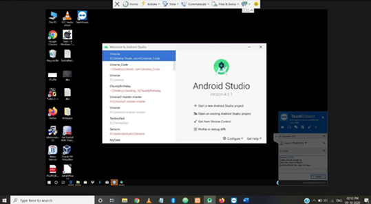
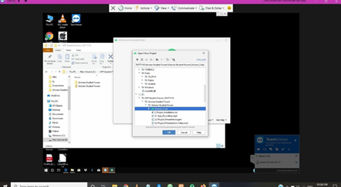
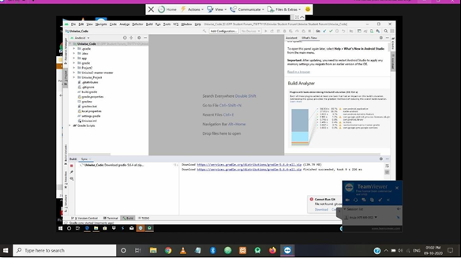
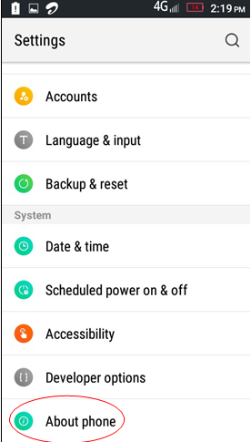
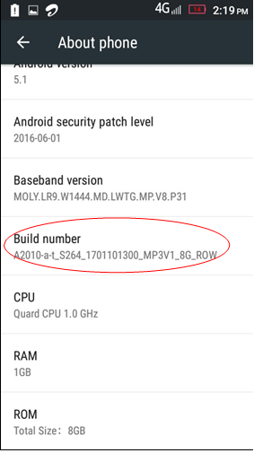
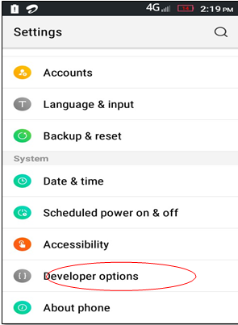
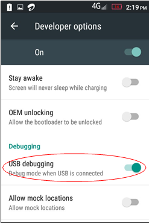
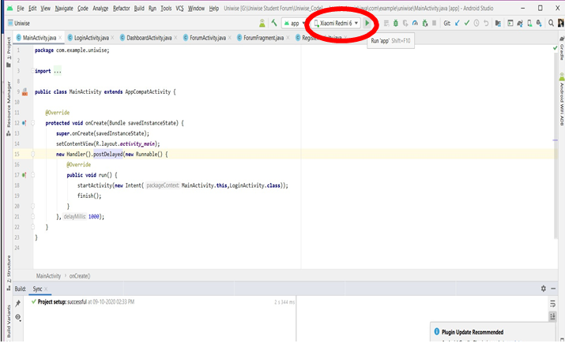
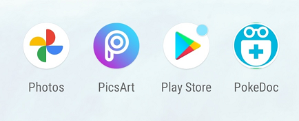
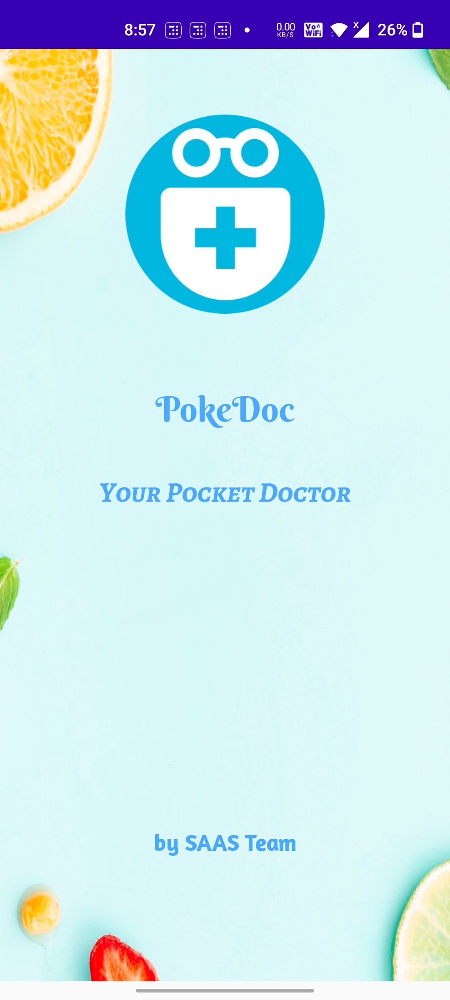

# PokeDoc
## *ACM's WCE Hackathon project named PokeDoc-Your Pocket Doctor by SAAS Team.*

### PokeDoc - The Pocket Doctor
The central idea of our project is to provide a simple interface for interactions between a doctor and patients. It also focuses on giving a single interface for all the health care needs of an individual while providing easy access of patient's information to the doctor. This information compromises his daily nutritions, his reports as well as prescriptions.

### Description:

In this application there are two modules: 
- Patient
-  Doctor

### Patient:
- Login with your personal account.
- Add daily Nutrition.
- Counts calories, proteins and carbohydrates.
- Can chat with the doctor.
- View and download Reports and Prescriptions.
- Can edit user information using Settings.

### Doctor:
- Add and Delete Patients.
- View Patient Nutrition Chart.
- Suggest through Chat.
- Add Prescription and view Report.
- Can edit user information using Settings.

### Uniqueness:

Most applications focus on providing immediate access from a list of registered doctors. However, PokeDoc focuses on providing the same immediate access but to a doctor who already knows the patient's various conditions and is trusted by the patient as well. The quick access to the patient's nutrition values will help the doctors in providing the best possible result for the patient.

### Basic Requirements:

1. Android Studio IDE on your Laptop/Desktop.
2. Android Smartphone with Lollipop and above android versions.
3. Internet Connection.

### Steps for Installation:
### 1. Install the Android Studio IDE on your Laptop/Desktop.

### 2. Open the android code which you have just downloaded, via Android Studio IDE.

### 3. Once the source code is opened in the Android Studio window, wait until the code is configured and the build is running.

### 4. In your mobile phone enable the Developer mode.
  Steps for enabling the Developer mode:
 1. Click on the About Phone options in the settings of your mobile phone.

2. Next, click on Build Number option for 7 times.

3. It will show you a toast message, and your Developer Options will be enabled.

### 5. Now, click on the Developer Options in the settings of your mobile phone.
 

 
### 6. Enable the USB Debugging mode.

### 7. Connect your Android mobile phone via USB cable to your Laptop/Desktop.

### 8. Click on the 'Run' button(Green Triangle Button) in your Android Studio window after detecting your mobile name.

### 9. Wait until the application is installed on your android mobile phone.

### 10. Once the application has been installed, feel free to use the 'PokeDoc' app on your phone!

